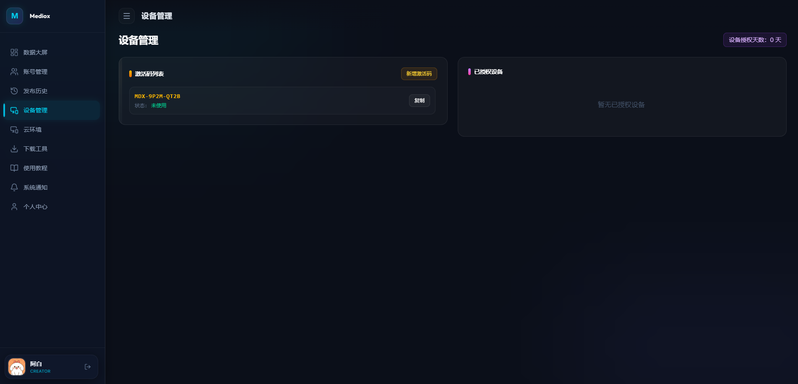
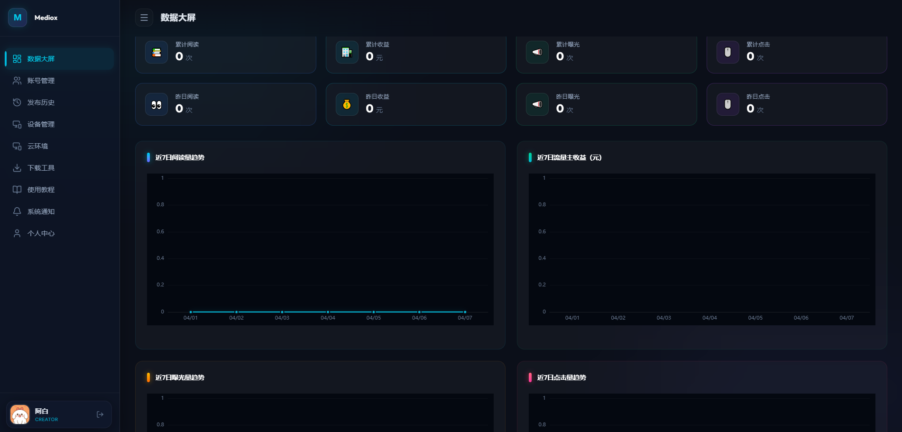
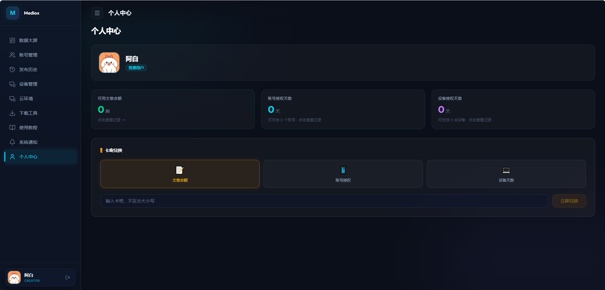
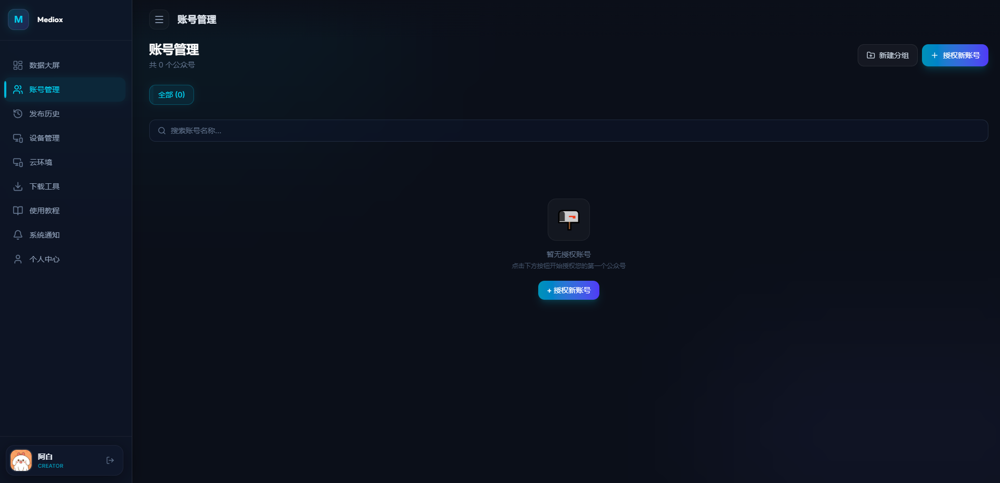
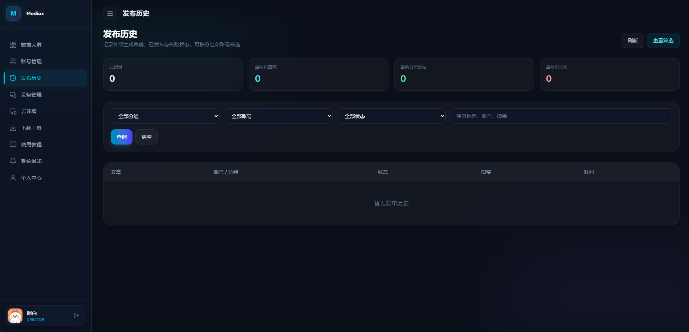
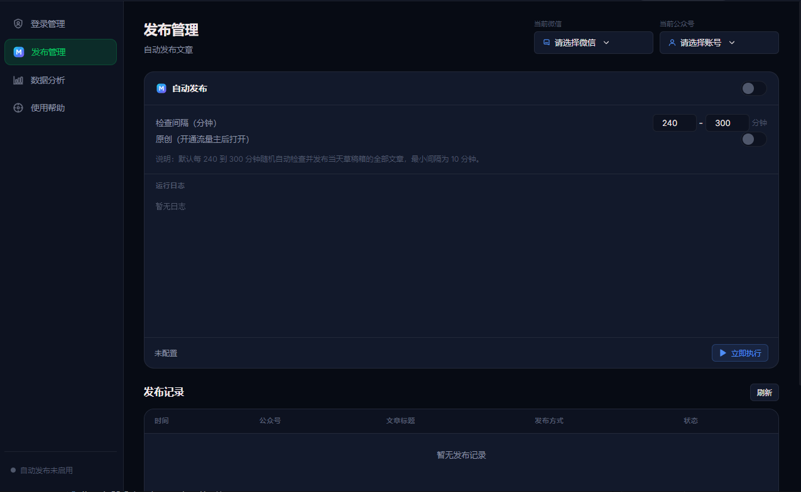

# Mediox

官网地址：https://mediox.daniu7.cn/

Mediox 是一套面向微信公众号生态的智能运营与授权管理平台，帮助团队把「账号管理、内容分发、设备授权、数据统计、通知触达」整合到一个统一后台里，让运营更高效、管理更清晰、增长更可控。

> 用一套系统，管理你的公众号运营全链路。

> 已运营 5000+ 账号，单号收益可达 300-500+，真正的实现释放双手，被动收入。

## 为什么选择 Mediox

如果你正在管理多个公众号、多个设备、多个运营角色，最容易遇到的不是功能不够，而是流程太散、数据太乱、协作太慢。Mediox 就是为了解决这些问题而生：

- **统一管理**：账号、设备、授权、通知、发布记录集中在一个后台

- **数据可视化**：阅读、收益、曝光、点击等关键指标一屏掌握

- **运营提效**：卡密兑换、授权续费、设备激活、批量调整一站式处理

- **适合团队协作**：支持按用户、按账号、按设备进行精细化管理

## 核心亮点

### 0. AI 自动内容引擎（重点能力）
这是 Mediox 最受欢迎的增长能力组合：

- **自动生文**：可基于选题或关键词批量生成可发布内容

- **一键 AI 过原创**：自动进行语义重构与表达优化，提升内容原创度
- **自动发布**：内容处理完成后可按规则自动推送至目标公众号

从内容生产到分发，全流程自动化，大幅降低人工成本。

### 1. 公众号运营中枢
把公众号日常运营中最常用的功能都收拢到一个平台里：

- 账号管理
- 发布历史追踪
- 设备授权与激活
- 卡密兑换与额度管理
- 通知发布与系统公告
- 自动生文、AI 过原创、自动发布

### 2. 真实数据大屏
Mediox 不只是一个管理后台，更是一个运营驾驶舱：

- 累计阅读 / 昨日阅读
- 累计收益 / 昨日收益
- 累计曝光 / 昨日曝光
- 累计点击 / 昨日点击
- 近 7 日趋势图表

让业务状态不再靠猜，增长表现一眼可见。

### 3. 面向运营的权限体系
针对不同角色提供不同能力：

- 管理员可统一管理用户、配置规则、调整额度
- 普通用户只查看自己的绑定账号和个人数据
- 每个用户只看到自己账号范围内的统计结果

### 4. 灵活的额度与授权机制
支持文章篇数、账号授权天数、设备授权天数等多维额度管理，适合：

- 付费授权
- 团队配额分发
- 运营奖励
- 批量补偿或扣减

## 适用场景

- 公众号矩阵运营团队
- 内容分发与代运营工作室
- 需要统一管理授权和设备的业务系统
- 希望把数据、权限、发布、通知整合起来的企业内部平台

## 技术栈

- **后端**：FastAPI + MongoDB
- **前端**：Vue 3 + Vite + Pinia + Vue Router
- **可视化**：ECharts
- **部署**：Docker + Nginx

## 项目价值

Mediox 的价值不只是“功能多”，而是让公众号运营从碎片化工具组合，升级成一套可持续增长的管理体系：

- 提升运营效率
- 降低人工管理成本
- 减少授权与设备管理混乱
- 让数据驱动决策成为常态
- 让团队协作更顺畅
- 让内容生产、原创处理、分发执行形成自动化闭环

前端和后端都会通过容器化方式运行，适合本地测试、内网部署和生产环境迁移。

## 联系与定制

如果你希望把 Mediox 用在你自己的公众号业务中，也可以进一步做：

- 品牌定制
- 功能裁剪
- 数据口径适配
- 私有化部署
- 多租户扩展

---

**Mediox**：让公众号运营更专业，让管理更简单，让数据真正服务增长。
